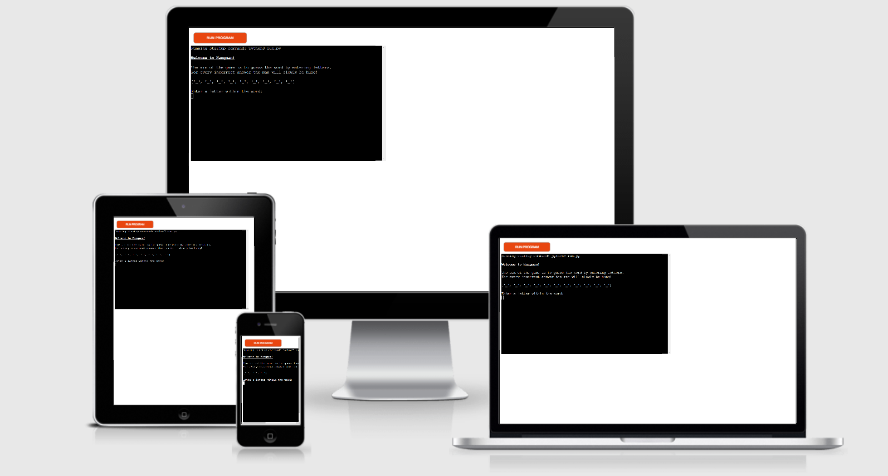
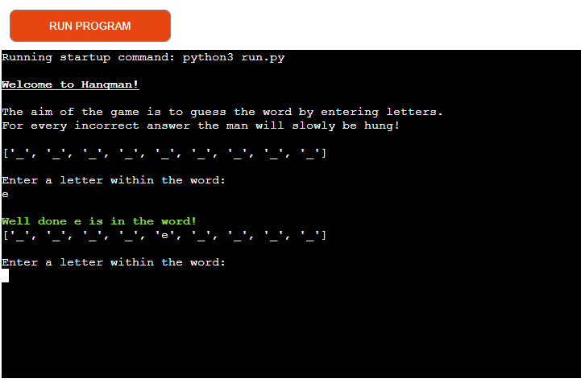
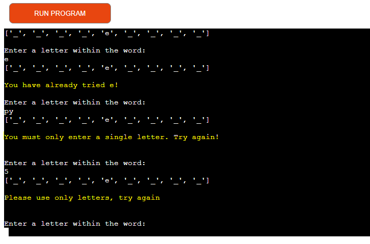
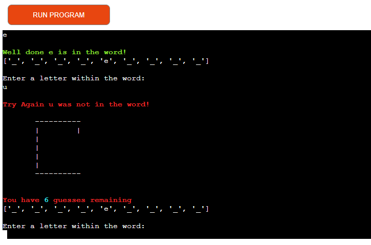

[Live Link](https://hangman-game-python3.herokuapp.com/)
[GitHub Repository](https://github.com/sophiebatten123/Hangman)

# Hangman 

(Developer: Sophie Batten)

Hangman is a Python terminal game, which runs in the Code Institute mock terminal on Heroku.

# How to play Hangman

Hangman is a quick and easy word guessing game. The inital set up of the game displays a gallow and an underscore for each letter within the unknown word.

The player must enter a letter they believe is contained within the word. 

If the answer is correct the letter guessed will appear in the correct location on the corresponding underscore. However, be careful, if too many letters are guessed that do not appear within the word the player is hanged and looses the game. 

# Features

## Existing Features

- Random word generation:
    - Words are randomly generated after each game and the characters within the word are displayed as underscores.

- Input validation and error-checking:
    - The game accepts the users input and ensures that answers must be written in a certain format.
        - You cannot enter letters. Try Again!
        - You must only enter one letter. Try Again!
        - You have already inputted this answer. Try Again!

- Lives are generated for the user to see and this is incremented after each incorrect answer.

## Future Features
- Gives the user a hint based upon the word displayed on the screen.

# Data Model

# Testing
The game has been manually tested using the following:
- The code was passed through PEP8 linter and this confirmed there were no problems.
- Code was regularly tested in my local terminal and on the Code Institute Heroku terminal.

# Bugs

# Deployment
This project was deployed using the Code Institute's mock terminal for Heroku.

The steps undertaken for this were:
1. The repository was cloned.
2. A Heroku app was created.
3. Buildbacks were set to Python and NodeJS (specifically in this order).
4. The Heroku app was linked to the repository.
5. Deploy button was clicked.

# Credits

- Code Institute for supplying the deployment terminal.
- The Hangman game was inspired by a YouTube tutorial and the structure of this and initial ideas were used to create my site: [How to build HANGMAN with Python](https://www.youtube.com/watch?v=m4nEnsavl6w)
- Help and support was provided by the Code Institute Tutors on some of the logic functions within my site.

Thank you to the tutors of Code Institute for the help given throughout this project.
