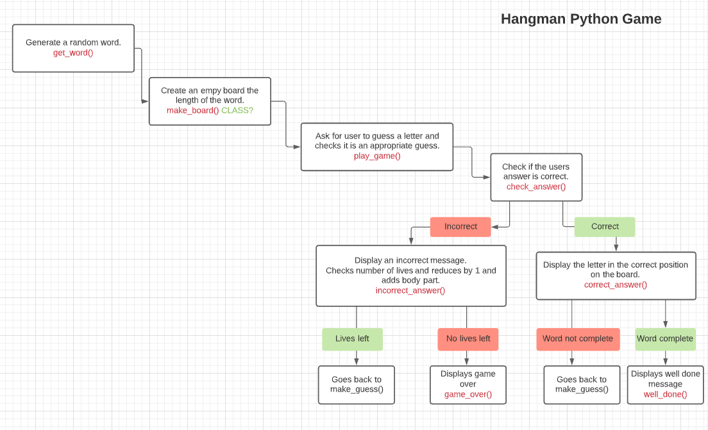

[Live Link](https://hangman-game-python3.herokuapp.com/)
[GitHub Repository](https://github.com/sophiebatten123/Hangman)

# Hangman 

(Developer: Sophie Batten)

Hangman is a Python terminal game, which runs in the Code Institute mock terminal on Heroku.

# How to play Hangman

Hangman is a quick and easy word guessing game. The initial set up of the game displays gallows and an underscore for each letter within the unknown word.

The player must enter a letter they believe is contained within the word. 

If the answer is correct the letter guessed will appear in the correct location on the corresponding underscore. However, be careful, if too many letters are guessed that do not appear within the word the player is hanged and loses the game. 

For more information on how to play Hangman click the following link: [Wikipedia - How to play Hangman](https://en.wikipedia.org/wiki/Hangman_(game))

# Features

## Existing Features

- Random word generation:
    - Words are randomly generated after each game and the characters within the word are displayed as underscores.

- Input validation and error-checking:
    - The game accepts the users input and ensures that answers must be written in a certain format.

- Alongside the hangman model, users are told after each incorrect answer how many guesses they have remaining. This was done to improve UX (User Experience) making the game clear and efficient.

## Future Features
- Users could be given hints based upon the word displayed on the screen.
- The game could be used for educational purposes to help pupils revise keywords given definitions.

# Data Model

Functions and lists were the predominant features used throughout the game. These were organised carefully to ensure a consistent flow of code which can be seen below:

## Program Logic

Below is the logic flow chart used to map out the initial stages of the Hangman game ensuring the code written was efficient and served its purpose.

## Program Libraries

The game uses [Rich 10.16.2](https://rich.readthedocs.io/en/stable/introduction.html) Python library to generate styling and colour within in game terminal.
This Python library was imperative to the game, making elements of the page easier for the user to distinguish and improving the overall UX (User Experience).

# Testing
The game has been manually tested using the following:
- The code was passed through PEP8 and this confirmed there were no problems.
- Code was regularly tested in my local terminal and on the Code Institute Heroku terminal.

# Bugs

## Solved Bugs

- When writing my code, I was getting indentation errors due to either missing a blank line and the end of the document or adding extra white space after a line of code. This was fixed by ensuring all code was appropriately indented and these were highlighted in the 'problems' section of the terminal.
- Initially the guesses list within my code was returning a blank list after each round of the game. This was a result of the list being defined locally instead of as a global variable. This issue was fixed by globally assigning the variable using UPPERCASE notation.

## Remaining Bugs

- Upon deployment there were no bugs remaining within the code.

## Validator Testing

[PEP8](PEP8online.com) was used to validate my code and no errors were returned.

# Deployment
This project was deployed using the Code Institute's mock terminal for Heroku.

The steps undertaken for this were:
1. The repository was cloned.
2. A Heroku app was created.
3. Buildbacks were set to Python and NodeJS (specifically in this order).
4. The Heroku app was linked to the repository.
5. Deploy button was clicked.

# Credits

- Code Institute for supplying the deployment terminal.
- [Wikipedia](https://en.wikipedia.org/wiki/Hangman_(game)) was referenced within the README file to give users greater instructions on how to play Hangman
- The Hangman game was inspired by a YouTube tutorial and the structure was used to create my site: [How to build HANGMAN with Python](https://www.youtube.com/watch?v=m4nEnsavl6w)
- Help and support was provided by the Code Institute Tutors on some of the logic functions within my site.

Thank you to the tutors of Code Institute for the help given throughout this project.
